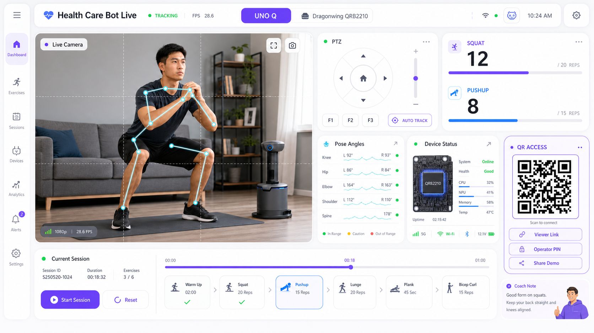

# UNO Q Health Care Bot 앱 기획서

## 1. 목표

Arduino UNO Q 기반 헬스 케어 로봇을 시연 현장에서 바로 체험할 수 있는 모바일 웹 앱(PWA)으로 확장한다. 사용자는 QR 코드를 스캔해 별도 설치 없이 접속하고, 실시간 카메라 화면, 운동 카운트, 자세 상태, PTZ 카메라 제어를 한 화면에서 사용할 수 있어야 한다.

핵심 목표는 다음과 같다.

- 시연 관람객은 3초 안에 QR로 라이브 화면에 접속한다.
- 운영자는 스마트폰에서 직접 pan/tilt/center 제어를 한다.
- 현재 구현된 `stream.mjpg`, `stats.json`, MoveNet 운동 카운터, PTZ serial 제어 구조를 최대한 유지한다.
- 여러 사람이 접속해도 제어권 충돌과 장비 오작동이 발생하지 않도록 한다.

## 2. 현재 프로젝트 이해

현재 `health_care_bot`은 UNO Q의 Qualcomm Dragonwing QRB2210 SoC/MPU가 담당하는 Linux 영역에서 Python 컨테이너 1개가 실행되는 구조다. STM32U585 MCU는 PTZ 서보처럼 실시간성이 필요한 제어를 맡는 구조로 본다.

- 메인 칩: Qualcomm Dragonwing QRB2210 SoC/MPU
- 실시간 제어: STM32U585 MCU
- 카메라: USB 카메라를 `cv2.VideoCapture`로 읽는다.
- 포즈 추론: MoveNet Thunder INT8 TFLite 모델을 사용한다.
- 운동 인식: 스쿼트와 푸시업을 `SquatCounter`, `PushupCounter`로 카운트한다.
- PTZ: Python `PTZController`가 serial 명령을 보내고, STM32U585 쪽 Arduino sketch가 서보를 움직인다.
- 웹 출력: `src/http_server.py`가 `GET /`, `GET /stream.mjpg`, `GET /stats.json`을 제공한다.

현재 웹 서버는 디버그 모니터링용에 가깝다. 앱화를 위해서는 다음이 추가되어야 한다.

- 정적 앱 화면(`/app`) 제공
- PTZ 직접 제어 API
- 운동 세션 시작/종료/리셋 API
- QR 접속 URL 생성 또는 표시
- 운영자 제어권 잠금
- 간단한 인증 또는 PIN

## 3. 제품 콘셉트

앱 이름 제안: `Health Care Bot Live`

앱은 설치형 네이티브 앱보다 모바일 웹 앱(PWA)로 시작하는 것이 적합하다. 시연장에서 QR 코드 접근성이 가장 좋고, Android/iOS 모두 카메라 화면과 제어 UI를 별도 배포 없이 사용할 수 있다.

첫 화면은 설명형 랜딩 페이지가 아니라 바로 실시간 대시보드다.

- 상단: 연결 상태, FPS, 운동 모드, 제어권 상태
- 중앙: 라이브 카메라 스트림
- 하단: PTZ 조이스틱, 카운트, 각도, 세션 버튼
- 보조 화면: 세션 리포트, 디바이스 설정, QR 표시

## 3.1 디자인 방향

디자인 레퍼런스는 Qualcomm의 Dragonwing 산업용 edge AI 톤을 기본으로 하되, 화면 인상은 Toss Tech처럼 둥글고 사용자 친화적인 제품 앱에 가깝게 잡는다. Altium 같은 엔지니어링 디테일은 과한 회로판/로봇 콘솔 느낌으로 쓰지 않고, 얇은 상태선과 telemetry chip 정도로만 절제한다. 특정 사이트의 레이아웃, 로고, 문구, 컴포넌트 형태는 복제하지 않는다.

색감은 Snapdragon의 red/gold/fireball 계열로 가지 않는다. UNO Q에 들어가는 칩은 Qualcomm Dragonwing QRB2210이므로 Dragonwing 계열의 purple을 포인트로 사용하고, 기본 화면은 off-white, white card, soft graphite text 중심으로 편안하게 만든다.

권장 컬러:

- Background: `#F7F8FA`, `#EEF2F7`
- Card: `#FFFFFF`, `#FDFEFF`
- Dragonwing primary: `#6F4DFF`, `#8B5CFF`
- Qualcomm blue accent: `#2F7DFF`
- Live telemetry cyan: `#28D7E8`
- Success: `#3EE58F`
- Warning: `#F4C542`
- Text: `#172033`, `#667085`
- Border: `rgba(20, 32, 55, 0.08)`
- Soft shadow: `0 12px 36px rgba(20, 32, 55, 0.10)`

레이아웃 원칙:

- 카메라 화면이 주인공이어야 한다. 데스크톱에서는 좌측 60-65%, 모바일에서는 첫 화면 상단 대부분을 차지한다.
- PTZ 조작은 카메라 바로 옆 또는 바로 아래에 둔다. 시선이 영상과 제어 사이에서 멀리 이동하지 않아야 한다.
- 정보 패널은 사용자에게 먼저 읽히는 큰 숫자와 짧은 문구를 우선한다. FPS, latency, inference time 같은 telemetry는 작은 chip으로 보조 배치한다.
- 카드 반경은 18-24px 수준으로 둥글게 잡고, 버튼은 pill 형태를 쓴다.
- 중첩 카드와 큰 마케팅 hero는 금지한다. 첫 화면은 곧바로 조작 가능해야 하지만, 관제실보다 생활형 운동 코치 앱처럼 보여야 한다.
- QR은 별도 큰 화면으로 숨기지 않고, 우측 패널 또는 하단 drawer에서 항상 접근 가능하게 둔다.
- 로봇/군사용 콘솔처럼 보이는 검은 배경, 과한 회로 trace, 각진 패널, 네온 과다 사용은 피한다.

레퍼런스 이미지:



## 4. 사용자 유형

### 관람객

QR을 스캔해 라이브 화면과 운동 카운트만 본다. 여러 명이 동시에 접속해도 장비를 움직일 수 없다.

권한:

- 라이브 카메라 보기
- 현재 운동 종목, 카운트, 자세 상태 보기
- 세션 결과 보기

### 운영자

시연 담당자 또는 발표자가 사용한다. PIN 또는 운영자 QR로 접속해 PTZ를 직접 조작하고 운동 세션을 리셋한다.

권한:

- PTZ pan/tilt/center 직접 제어
- 자동 추적 on/off
- 운동 모드 변경
- 카운트 리셋
- 세션 시작/종료
- QR 화면 표시

## 5. 접속 모델

### 권장 시연 방식

시연 부스에 QR 2개를 둔다.

1. 보기 전용 QR: `http://healthbot.local:8080/app?role=viewer`
2. 운영자 QR: `http://healthbot.local:8080/app?role=operator&token=<demo-token>`

관람객용 QR은 안전하게 공개한다. 운영자 QR은 발표자 기기 또는 안내 데스크에만 둔다. 운영자 토큰은 부팅할 때 새로 만들거나 `.env`에 고정한다.

### 네트워크 옵션

1. 같은 Wi-Fi 공유기 사용
   - QR URL: `http://<UNO_Q_IP>:8080/app`
   - 가장 단순하지만 IP가 바뀔 수 있다.

2. mDNS 사용
   - QR URL: `http://healthbot.local:8080/app`
   - 데모 품질이 좋다.

3. UNO Q 자체 핫스팟
   - Wi-Fi QR: SSID와 비밀번호
   - 접속 QR: 앱 URL
   - 외부 네트워크가 불안정한 행사장에서 가장 안정적이다.

## 6. 핵심 기능

### 6.1 실시간 카메라 뷰

현재 `GET /stream.mjpg`를 그대로 사용한다. 모바일 앱에서는 ``로 표시한다.

구현 가능 범위:

- 목표 지연 시간은 같은 로컬 네트워크 기준 120ms-300ms로 잡는다.
- 포즈 스켈레톤, 각도, 카운트 overlay 표시
- 스트림 끊김 감지 후 자동 재연결
- 가로/세로 화면 대응

이전 문서의 200ms-800ms 표현은 너무 보수적이다. 현재 SSH 접속으로 확인되는 반응성이 크게 나쁘지 않다면, 앱에서도 같은 LAN 안에서는 800ms까지 보는 것이 기본 가정이 되어서는 안 된다. 800ms는 네트워크와 브라우저가 나빠졌을 때의 worst-case budget으로만 남긴다.

지연은 다음 단계에서 누적된다.

1. 카메라 캡처: `cv2.VideoCapture`가 최신 프레임을 즉시 주면 낮지만, 드라이버 버퍼가 쌓이면 1-2프레임이 늦을 수 있다.
2. 추론 루프: MoveNet 추론, pose draw, angle 계산이 한 루프를 차지한다. 현재 `stats.json`의 `loop_ms`, `fps`가 실제 앱 지연의 첫 지표다.
3. JPEG 인코딩: `cv2.imencode('.jpg')`가 매 프레임 실행된다. 품질이 높거나 해상도가 커지면 지연이 늘어난다.
4. MJPEG 전송: `http.server`가 multipart JPEG를 밀어준다. 같은 Wi-Fi에서는 가볍지만, 관람객이 많으면 CPU와 네트워크 대역폭을 같이 쓴다.
5. 브라우저 디코딩/렌더링: 모바일 브라우저가 MJPEG를 ``로 디코딩한다. 기기 성능과 절전 상태에 따라 차이가 난다.
6. 상태 polling: 카운트와 PTZ 상태는 `stats.json`을 500ms polling하면 숫자 갱신만 느려 보일 수 있다. 영상 지연과 상태 지연을 분리해서 봐야 한다.

따라서 1차 앱의 목표는 다음처럼 잡는다.

- 영상 체감 지연: 같은 LAN 기준 120ms-300ms
- 상태 숫자 갱신: 250ms-500ms polling
- PTZ 버튼 입력 후 API 응답: 100ms 이내
- PTZ 실제 움직임 시작: serial write 직후 100ms-300ms 이내
- 800ms 이상은 정상 목표가 아니라 혼잡한 Wi-Fi, 낮은 모바일 성능, 높은 JPEG 품질, 다중 접속, 카메라 버퍼 누적이 겹친 장애 징후로 본다.

측정 방법:

- `stats.json.loop_ms`와 `stats.json.fps`를 앱 상단에 표시한다.
- 서버에서 JPEG 생성 시각 `frame_ts_ms`를 stats에 추가하고, 브라우저 수신 시각과 차이를 계산한다.
- 카메라 프레임에 millisecond timestamp overlay를 넣어 스마트폰 화면 녹화로 end-to-end 지연을 검증한다.

향후 개선:

- 카메라 버퍼가 쌓이면 capture thread를 분리해 항상 최신 프레임만 유지한다.
- 관람객이 많아지면 viewer용 스트림 FPS를 제한하고 operator 스트림을 우선한다.
- WebRTC 스트리밍은 300ms 이하 안정화가 필요하거나 외부 네트워크 시연이 필요할 때 검토한다.
- 원본 카메라와 overlay 카메라를 선택하게 한다.

### 6.2 PTZ 직접 제어

운영자 화면에 직접 제어 패널을 제공한다.

필수 컨트롤:

- 좌/우 pan nudge
- 상/하 tilt nudge
- center 복귀
- 자동 추적 on/off
- step 크기 선택: 작게 2도, 보통 5도, 크게 10도
- emergency stop 또는 control lock 해제

권장 UX:

- 화면 아래 엄지 조작 영역에 방향 버튼을 둔다.
- 버튼을 누르면 즉시 한 번 움직이는 nudge 방식으로 시작한다.
- 길게 누르기 연속 이동은 2차 기능으로 둔다. 서보 속도와 serial 큐 안정성이 확인된 뒤 추가한다.
- 카메라 화면 위에 3x3 가이드 라인을 표시해 피사체가 어느 방향으로 벗어났는지 알 수 있게 한다.

서버 API 예시:

```http
POST /api/ptz
Content-Type: application/json

{
  "command": "pan",
  "delta_deg": -5
}
```

지원 명령:

- `pan`: `{ "delta_deg": -10..10 }`
- `tilt`: `{ "delta_deg": -10..10 }`
- `center`: `{}`
- `auto_track`: `{ "enabled": true }`
- `stop`: `{}`

응답 예시:

```json
{
  "ok": true,
  "ptz": {
    "enabled": true,
    "state": "in_frame",
    "pan_cmds_total": 12,
    "tilt_cmds_total": 3
  }
}
```

### 6.3 운동 세션

운동 세션을 명확히 분리하면 시연 품질이 올라간다.

기능:

- 세션 시작
- 세션 일시정지
- 카운트 리셋
- 종목 선택: `auto`, `squat`, `pushup`
- 목표 횟수 설정
- 세션 종료 후 요약 표시

세션 요약:

- 총 시간
- 스쿼트 횟수
- 푸시업 횟수
- 평균 FPS
- 마지막 rep의 최저 각도
- 추적 상태: 정상/edge/lost 비율

API 예시:

```http
POST /api/session/start
POST /api/session/reset
POST /api/session/finish
POST /api/mode
```

`POST /api/mode` body:

```json
{
  "mode": "auto"
}
```

### 6.4 실시간 상태 카드

현재 `stats.json`에 있는 정보를 앱 화면에서 사용자 친화적으로 재구성한다.

표시 항목:

- 연결 상태: Online, Reconnecting, Offline
- 현재 종목: Squat, Pushup, Unknown
- 카운트: Squat reps, Pushup reps
- 현재 각도: left/right/used
- PTZ 상태: in frame, edge, lost
- 카메라 성능: FPS, dropped frames

관람객에게는 기술 지표를 줄이고 큰 카운트와 상태만 보여준다. 운영자에게는 FPS, serial, PTZ command count를 표시한다.

### 6.5 자세 피드백

현재 모델이 이미 각도와 rep 상태를 계산하므로 간단한 피드백은 구현 가능하다.

스쿼트:

- `DOWN` 상태가 너무 얕으면 "조금 더 내려가세요"
- rep 완료 시 최저 각도를 기준으로 "좋아요" 또는 "조금 얕아요"

푸시업:

- 팔꿈치 각도가 충분히 접히지 않으면 "조금 더 내려가세요"
- 위로 올라온 각도가 충분하지 않으면 "끝까지 밀어주세요"

주의:

- 의료 진단 표현은 사용하지 않는다.
- "정확도"보다 "시연용 운동 피드백"으로 표현한다.

### 6.6 QR 코드 관리

앱 안에 운영자용 QR 화면을 추가한다.

기능:

- 현재 접속 URL QR 표시
- 보기 전용 URL 복사
- 운영자 URL QR 표시
- 현재 IP와 `healthbot.local` 주소 표시
- 네트워크 상태 체크

서버에서 QR 이미지를 직접 생성하거나, 프론트엔드에서 QR 라이브러리로 렌더링한다. 구현 단순성은 프론트엔드 렌더링이 더 좋다.

## 7. 화면 구성

### 7.1 Viewer Dashboard

관람객 기본 화면이다.

구성:

- 라이브 카메라 화면
- 큰 카운트: `Squat 12`, `Pushup 8`
- 현재 상태 배지: `Tracking`, `Repositioning`, `Lost`
- 세션 요약 미니 카드

조작:

- 전체화면 전환
- 소리/진동 피드백 on/off
- 결과 공유 QR 보기

### 7.2 Operator Control

운영자 화면이다.

구성:

- 라이브 카메라 화면
- PTZ 조이스틱
- center 버튼
- 자동 추적 토글
- 세션 시작/리셋/종료
- 운동 모드 segmented control: Auto / Squat / Pushup
- 시스템 상태 drawer

중요 UX:

- PTZ 버튼은 카메라 화면 바로 아래에 둔다.
- center는 별도 아이콘 버튼으로 크게 둔다.
- 위험한 리셋은 확인 모달을 둔다.
- 여러 운영자가 들어오면 "다른 기기가 제어 중"으로 표시한다.

### 7.3 Session Result

세션 종료 후 보여주는 결과 화면이다.

구성:

- 총 횟수
- 운동별 횟수
- 가장 좋은 rep 또는 최근 rep 각도
- 수행 시간
- QR로 결과 페이지 공유

저장 방식:

- 1차 구현은 서버 메모리에 최근 세션 1개만 저장한다.
- 2차 구현에서 JSON 파일 또는 SQLite 저장을 추가한다.

### 7.4 Device Setup

운영자만 접근한다.

구성:

- 카메라 해상도
- JPEG quality
- keypoint confidence threshold
- PTZ step degree
- frame-out margin
- serial status
- model/runtime 정보

주의:

- 대부분은 읽기 전용으로 시작한다.
- 실시간 변경은 안정성 검증 후 일부 옵션만 허용한다.

## 8. 앱 아키텍처

### 8.1 권장 구조

```text
health_care_bot/
  src/
    main.py
    http_server.py
    app_state.py
    api_server.py
    ptz_controller.py
  web/
    package.json
    src/
      App.tsx
      api.ts
      components/
      screens/
  ptz/
    sketch/
      health_care_ptz.ino
```

초기에는 `http_server.py`를 확장해도 된다. 다만 API가 늘어나면 `api_server.py` 또는 FastAPI 기반 서버로 분리하는 것이 좋다.

### 8.2 백엔드

권장 1차 구현:

- 현재 `http.server` 유지
- `POST` handler 추가
- 전역 상태에 `SessionState`, `ControlState` 추가
- `/app/*` 정적 파일 제공

권장 2차 구현:

- FastAPI + uvicorn으로 전환
- `/api/stats`, `/api/ptz`, `/api/session`, `/api/config`
- WebSocket 또는 Server-Sent Events로 상태 push
- CORS는 기본 off, 로컬 네트워크 전용

### 8.3 프론트엔드

권장 1차 구현:

- Vite + React + TypeScript
- PWA manifest 추가
- MJPEG는 ``로 표시
- 상태는 `fetch('/stats.json')`를 500ms polling
- PTZ는 `fetch('/api/ptz', { method: 'POST' })`

권장 라이브러리:

- React
- TypeScript
- Vite
- qrcode.react 또는 QRCode.js
- lucide-react

React를 쓰지 않는 경량 구현도 가능하지만, 운영자 화면과 세션 화면이 늘어날 가능성이 높아 React가 유지보수에 유리하다.

## 9. 데이터 계약

### 9.1 상태 조회

기존 `GET /stats.json`을 유지한다. 앱에서는 다음 필드를 사용한다.

- `fps`
- `mode`
- `exercise_active`
- `orientation`
- `angle_deg`
- `person_center_norm`
- `squat.reps`
- `pushup.reps`
- `ptz.state`
- `ptz.enabled`
- `last_ptz_cmd`
- `dropped_frames`

추가 권장 필드:

```json
{
  "app": {
    "session_id": "20260708-001",
    "session_running": true,
    "operator_locked_by": "phone-a",
    "auto_track_enabled": true,
    "viewer_count": 4
  }
}
```

### 9.2 PTZ 제어

```http
POST /api/ptz
```

```json
{
  "command": "tilt",
  "delta_deg": 5,
  "client_id": "operator-phone-1"
}
```

검증 규칙:

- operator 권한이 있어야 한다.
- 제어권 lock을 가진 client만 실행한다.
- `delta_deg`는 서버에서 최대값을 제한한다.
- 명령 간 최소 간격을 둔다.

### 9.3 제어권 획득

```http
POST /api/control/claim
```

```json
{
  "client_id": "operator-phone-1",
  "pin": "1234"
}
```

응답:

```json
{
  "ok": true,
  "lock_until_ms": 60000
}
```

제어권은 60초마다 heartbeat로 연장한다.

## 10. 구현 로드맵

### Phase 1: 데모 가능한 앱

목표: QR 접속, 라이브 보기, PTZ 직접 제어를 완성한다.

작업:

- `/app` 정적 앱 제공
- 모바일 대시보드 UI
- `POST /api/ptz` 추가
- `POST /api/session/reset` 추가
- viewer/operator role 구분
- QR 코드 화면
- 스트림 끊김 자동 복구

완료 기준:

- 휴대폰에서 QR 접속 가능
- 라이브 화면 표시
- 좌/우/상/하/center 제어 가능
- 카운트 리셋 가능
- 관람객 URL에서는 PTZ 버튼이 숨겨짐

### Phase 2: 시연 품질 개선

목표: 현장에서 안정적으로 보이고, 관람객 경험을 높인다.

작업:

- 제어권 lock
- 세션 시작/종료/결과 화면
- 자세 피드백 문구
- mDNS 또는 핫스팟 안내
- 연결 상태 진단
- 모바일 가로 화면 최적화

완료 기준:

- 여러 명이 동시에 접속해도 한 명만 PTZ 제어
- 세션 결과가 명확히 표시됨
- 네트워크 끊김 후 자동 복구

### Phase 3: 제품형 확장

목표: 시연을 넘어 반복 사용 가능한 도구로 만든다.

작업:

- FastAPI 전환
- WebSocket/SSE 상태 push
- WebRTC 스트리밍 검토
- 세션 기록 저장
- 사용자별 목표 운동
- 카메라/모델 설정 UI
- OTA 또는 업데이트 상태 표시

## 11. 안전 및 운영 정책

- HTTP 서버는 로컬 네트워크 전용으로 둔다.
- 공개 QR은 viewer 권한만 제공한다.
- 운영자 권한은 PIN 또는 토큰으로 제한한다.
- PTZ 명령은 서버에서 각도와 빈도를 제한한다.
- 서보 이동 중 연속 명령이 쌓이지 않도록 명령 큐 크기를 제한한다.
- 카메라 화면에는 개인정보 안내 문구를 시연 공간에 별도로 게시한다.
- 앱 문구는 의료 진단처럼 보이지 않게 한다.

## 12. 첫 구현에서 필요한 코드 변경

### 백엔드

- `src/http_server.py`
  - `do_POST` 추가
  - `/api/ptz`, `/api/session/reset`, `/api/control/claim` 처리
  - 정적 파일 `/app` 제공

- `src/main.py`
  - `PTZController` 인스턴스를 HTTP handler에서 접근 가능한 app state에 연결
  - counter reset을 외부 API에서 호출할 수 있게 상태 객체화
  - auto track enabled flag 반영

- `src/ptz_controller.py`
  - manual command 메서드 추가: `manual_pan`, `manual_tilt`, `manual_center`
  - auto tracking on/off 지원

### 프론트엔드

- `web/src/App.tsx`
  - role 기반 화면 분기
  - 라이브 스트림
  - 상태 polling
  - PTZ control panel

- `web/src/api.ts`
  - `getStats`
  - `sendPtz`
  - `resetSession`
  - `claimControl`

- `web/src/components`
  - `LiveCamera`
  - `RepCounter`
  - `PtzPad`
  - `StatusBar`
  - `QrPanel`
  - `SessionSummary`

## 13. 추천 MVP 화면 상세

### 데스크톱/태블릿 운영자 레이아웃

```text
┌────────────────────────────────────────────────────────────────────────────┐
│ Health Care Bot Live | UNO Q Dragonwing QRB2210 | ONLINE | FPS 28.6       │
├──────────────────────────────────────────────┬─────────────────────────────┤
│                                              │ PTZ                         │
│              LIVE CAMERA                     │        ▲                    │
│      pose skeleton + 3x3 guide               │    ◀   ●   ▶   CENTER      │
│                                              │        ▼                    │
│                                              ├─────────────────────────────┤
│                                              │ REPS                        │
│                                              │ SQUAT 12    PUSHUP 8        │
│                                              │ angle used 92° | state DOWN │
├──────────────────────────────────────────────┼─────────────────────────────┤
│ session timeline | last rep | tracking edge  │ QR ACCESS | operator lock   │
└──────────────────────────────────────────────┴─────────────────────────────┘
```

### 모바일 레이아웃

모바일에서는 카메라를 첫 화면의 55-60%로 두고, 그 아래에 PTZ와 reps를 탭 없이 바로 배치한다. QR, 세부 telemetry, session result는 하단 drawer로 접는다.

```text
┌────────────────────────────┐
│ Bot Live | ONLINE | 28 FPS │
├────────────────────────────┤
│                            │
│       LIVE CAMERA          │
│   skeleton + frame guide   │
│                            │
├──────────────┬─────────────┤
│ SQUAT 12     │ PUSHUP 8    │
│ ANGLE 92°    │ TRACKING    │
├──────────────┴─────────────┤
│        ▲       CENTER      │
│    ◀   ●   ▶   AUTO ON     │
│        ▼       QR          │
└────────────────────────────┘
```

관람객은 PTZ 영역 대신 큰 카운트, live status, QR 공유만 본다. 운영자는 같은 위치에서 PTZ 패드를 본다.

## 14. 성공 지표

- QR 스캔 후 앱 첫 화면 표시까지 3초 이내
- 라이브 스트림 재연결 성공률 95% 이상
- 같은 LAN에서 영상 체감 지연 120ms-300ms 목표, 800ms 이상은 장애 징후로 분류
- PTZ 버튼 입력 후 API 응답 100ms 이내
- PTZ 버튼 입력 후 카메라 움직임 시작까지 300ms 이내
- 5명 이상 동시 접속 시 서버 유지
- 시연자가 설명 없이 center, pan, tilt, reset을 사용할 수 있음

## 15. 최종 권장안

최우선은 네이티브 앱이 아니라 PWA다. 현재 프로젝트가 이미 HTTP MJPEG와 JSON 상태를 제공하므로, 모바일 웹 앱을 붙이는 방식이 가장 빠르고 안정적이다. 1차 MVP에서는 `http_server.py`에 필요한 API를 얇게 추가하고, 프론트엔드는 `/app`으로 정적 제공한다. 시연용 QR은 viewer/operator를 나누고, 직접 PTZ 제어는 운영자 권한에서만 열어 장비 안전과 관람객 접근성을 동시에 만족시키는 구조가 좋다.
