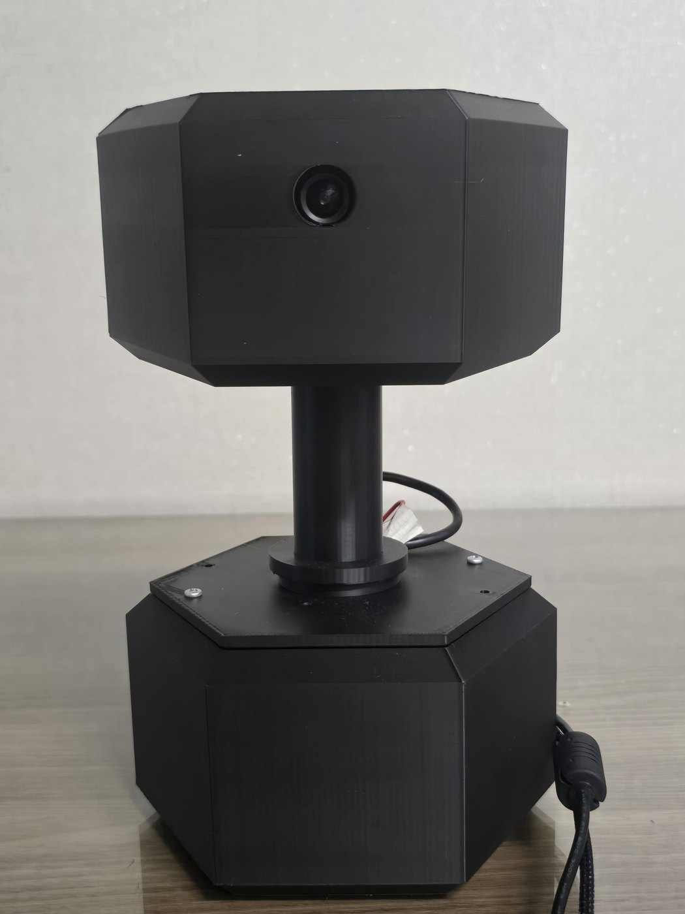
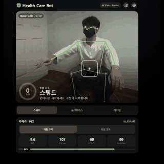
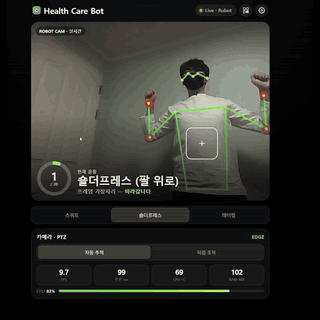
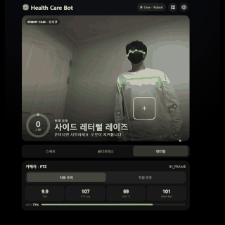
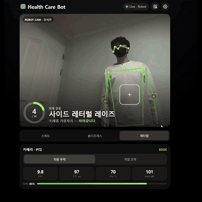

# health_care_bot — UNO Q Health Coach Robot

> 한국어: [`README.md`](README.md)

A health coach robot running as a **single Docker container, single process** on an
Arduino UNO Q (Qualcomm Dragonwing QRB2210, quad-core Cortex-A53 + STM32U585).

It watches your posture through a camera and **counts your reps**, **follows you with a
PTZ gimbal**, and **serves the mobile web app** — all from the same process.

<table>
<tr>
<td colspan="2" align="center"><br>
<sub><b>Gimbal housing v8.43</b> · <b>Head</b>: camera + pitch motor (ID=2) · <b>Base</b>: yaw motor (ID=1) + UNO Q, powered hub, servo adapter<br>Both servos sit on one daisy-chained bus</sub></td>
</tr>
<tr>
<td width="50%"><br>
<sub><b>Squat</b> — knee angle 100°↔140° · counter 0→3</sub></td>
<td width="50%"><br>
<sub><b>Overhead press</b> — shoulder elevation 60°↔140° · 1→3</sub></td>
</tr>
<tr>
<td width="50%"><br>
<sub><b>Side lateral raise</b> — same angle, 35°↔80° · 0→2</sub></td>
<td width="50%"><br>
<sub><b>PTZ auto-tracking</b> — the gimbal pans to follow (watch the background change) · reacquires after the subject leaves frame · <code>EDGE</code>↔<code>IN_FRAME</code></sub></td>
</tr>
<tr>
<td colspan="2"><sub>All four are screen recordings of <code>:8080/app</code> with <b>no speed-up</b> — every 4th frame of a 30 fps capture, played at 7.5 fps, which is real time.
The <b>9.7 FPS · 96 ms · 69 °C · CPU 84 %</b> visible on screen are the live measurements from that moment, matching the table in §9.</sub></td>
</tr>
</table>

> **Documentation note** — This README is the entry point. The detail lives in
> `docs/00`–`docs/09`, **written in Korean**. Their tables, numbers, API schemas and
> command lines are readable without Korean, and the section numbers cited here match.

> **Sister repo** — The MoveNet Thunder INT8 model this robot uses came from
> [`donghee-ai/unoq-edge-ai-lines`](https://github.com/donghee-ai/unoq-edge-ai-lines),
> which measured Vision · Pose · ASR on the same NPU-less UNO Q using CPU only. This repo
> is the product line built from its Pose assets.

---

## 1. What actually runs

| # | Feature | Implementation | Status |
|---|---|---|---|
| 1 | **Squat** counting | knee angle hip-knee-ankle, hysteresis 100°↔140° | works (thresholds still need field tuning) |
| 2 | **Overhead press** counting | shoulder elevation elbow-shoulder-hip, 60°↔140° | works (same) |
| 3 | **Side lateral raise** counting | same shoulder elevation angle, 35°↔80° | works (same) |
| 4 | **PTZ auto-tracking** | two ST3215 bus servos, per-exercise upper/lower-body framing + inertial recovery on loss | verified on hardware |
| 5 | **Web app** (`:8080/app`) | live MJPEG + counters + PTZ control + telemetry | verified on hardware |
| 6 | **Guard mode** | a fourth mode, separate from exercise. Homes immediately on entry → arms after 5 s → on person detection, tracks and captures automatically (`captures/`) → returns home after 10 s with no detection. Manual capture and a photo gallery are available from the web UI | verified on hardware |
| 7 | **Remote access** (Tailscale Funnel) | reach `/app` from outside the local Wi-Fi | verified on hardware (§3.2) |

**Exercises are not classified automatically.** All three are performed facing the camera
while standing, so body orientation cannot separate them — you pick the exercise in the web
UI (`POST /api/mode`). All three counters stay alive simultaneously, so switching modes
preserves each count.

> Push-ups were **removed** on 2026-07-26 — the arms bend along the camera's depth axis, so
> a 2D pose estimator smears the elbow angle. Rationale:
> [`docs/04_algorithm_exercise.md`](docs/04_algorithm_exercise.md) §7.

---

## 2. Architecture at a glance

```
[USB camera] --(FrameGrabber on its own thread: keeps only the newest frame)-->
      |
      v
[MoveNet Thunder INT8 / ai-edge-litert, 256x256 letterbox, 4 threads]
      |
      +--> 17 keypoints (y, x, conf)
             |
             +--> angles.py        knee / shoulder-elevation angles
             |      v
             |    exercise_counter.py   RepCounter (hysteresis + dwell) --> rep++
             |
             +--> ptz_controller.py  target point -> sector/deadzone decision -> deg/s control
             |      v
             |    st3215_bus.py (pyserial, 1 Mbaud, half-duplex)
             |      v
             |    [Bus Servo Adapter] -> [yaw ST3215 ID=1] -> [pitch ID=2]  (daisy chain)
             |
             +--> http_server.py   MJPEG + stats.json + /api/* + /app static serving
                    v
                  browser at http://<UNO_Q_IP>:8080/app
```

**Linux drives the servos directly — not through the MCU.** The ST3215 bus servo adapter
hangs off a USB hub on the UNO Q, and Linux (pyserial) talks to it. `ptz/sketch/health_care_ptz.ino`
is a leftover from the earlier MCU-mediated design and **is not used at runtime.**

Detail: [`docs/01_architecture.md`](docs/01_architecture.md)

---

## 3. Quick start

### 3.1 On the device (UNO Q) — normal operation

```bash
ssh arduino@192.168.0.50              # private LAN; get credentials from the device
cd ~/health_care_bot
bash docker/run.sh                    # auto-detects camera/servo nodes and starts
```

Open `http://192.168.0.50:8080/app` — PTZ control works immediately (control is shared).

Stop with `docker stop health-care-bot`.

> **Check before running** — `/dev/videoN` and `/dev/ttyACM*` numbers **change on every
> boot.** `run.sh` finds them by name, but always read the `camera:` / `serial:` lines in
> the startup log. Override manually with `CAMERA_DEV=/dev/video2 bash docker/run.sh`.
>
> **The IP is DHCP and can change when the router reboots** (it actually moved `.45`→`.50`
> on 2026-08-08). If it does not respond, rescan with `arp -a` or a ping sweep. See
> [`08_troubleshooting.md`](docs/08_troubleshooting.md).

### 3.2 Remote access — from outside the local Wi-Fi (Tailscale Funnel)

Set it up once; afterwards `docker/run.sh` alone opens remote access.

```bash
# once — install Tailscale on the device and log in
curl -fsSL https://tailscale.com/install.sh | sh
sudo tailscale up                     # open the printed URL on a phone/PC to authenticate

# only when needed — turn the public URL on/off (both need sudo; run over SSH)
sudo tailscale funnel --bg 8080
sudo tailscale funnel --https=443 off   # always turn this off when the demo ends
```

External URL: `https://<device>.<tailnet>.ts.net/app` — find the real address with
`tailscale status` on the device (not written here; this repo is public).
Between Tailscale devices without Funnel, use the UNO Q's Tailscale IP (`tailscale ip -4`).

> **This app has no real authentication beyond one PIN (default `1234`).** While Funnel is
> on, anyone with the link can see the camera, drive the PTZ, and browse guard-mode
> photos — use it only while showing a demo, and never leave it exposed.
>
> **FPS drops as stream viewers accumulate** — ~11.3 FPS with no viewer, ~10 with one, down
> to ~8 with two (e.g. PC + phone), measured. The cause is Python GIL thread contention plus
> encryption overhead when remote. The practical mitigation is lowering `--jpeg-quality`.

### 3.3 Development PC — servo test over direct serial

```powershell
cd C:\Project\health_care_bot

# full run (web app + counting + PTZ)
py -3.14 src/main.py models/movenet_thunder_int8.tflite --camera 0 --serial COM9 --serve 8080

# PTZ tracking alone (OpenCV window)
py -3.14 scripts/ptz_camera_track.py --port COM9 --camera 0 --drive
```

**Use `py -3.14`** — the Anaconda `base` environment on this PC has no `cv2`. The servo port
is **COM9** (CH343, 1,000,000 baud), and **without external servo power (6–12.6 V) the port
opens but every ID stays silent.**

### 3.4 Model setup — usually unnecessary

`models/movenet_thunder_int8.tflite` (7.1 MB) is **committed to this repo**, so a clone has
it already. You only need the script below when refreshing the model from the sister repo.

```bash
bash scripts/copy_model.sh    # ../unoq-companion-robot/pose/models/ -> models/
```

---

## 4. Layout

```
health_care_bot/
├── README.md / README_en.md    entry point (Korean / English)
├── THIRD_PARTY.md              third-party attribution (fonts, model, protocol)
├── src/                        runtime (what the container executes)
│   ├── main.py                 entry point: loop + CLI + telemetry
│   ├── pose_utils.py           keypoint constants / letterbox / centroid helpers / draw
│   ├── angles.py               knee_angle, shoulder_elev_angle, pick_angle
│   ├── exercise_counter.py     RepCounter + Squat/OverheadPress/LateralRaise
│   ├── ptz_controller.py       PTZ tracking + loss recovery + direct servo control
│   ├── st3215_bus.py           low-level ST3215 protocol driver
│   ├── http_server.py          MJPEG + stats.json + /api/* + /app + /captures/*
│   ├── app_state.py            session state + operator PIN control lock + guard state
│   └── guard_capture.py        guard mode: person decision + JPEG write + log
├── captures/                   guard-mode output (jpg + guard_log.jsonl) — gitignored
├── web/
│   ├── app/index.html          ★ the UI served at /app — self-contained, edited directly
│   ├── src/                    Vite + React design studies — archived, not served
│   └── dist/                   build output of the above — gitignored, /app works without it
├── docker/                     Dockerfile · requirements.txt · run.sh
├── models/                     movenet_thunder_int8.tflite
├── scripts/                    benchmarks and tools (not runtime)
├── ptz/sketch/                 MCU sketch — unused (MCU track on hold)
├── 3d_model/                   gimbal housing (source · 3mf · stl · validation · preview)
├── docs/                       see §5
└── backup/                     five restore points
```

---

## 5. Document map

All documents below are in Korean.

| # | Document | Contents |
|---|---|---|
| 00 | [`00_project_blueprint.md`](docs/00_project_blueprint.md) | blueprint — purpose, measured status, verification state, doc map |
| 01 | [`01_architecture.md`](docs/01_architecture.md) | processes/threads, module boundaries, state ownership, degrade paths |
| 02 | [`02_http_api_and_stats.md`](docs/02_http_api_and_stats.md) | HTTP API contract + full `stats.json` schema |
| 03 | [`03_algorithm_ptz_tracking.md`](docs/03_algorithm_ptz_tracking.md) | PTZ control law + inertial loss recovery + tuning |
| 04 | [`04_algorithm_exercise.md`](docs/04_algorithm_exercise.md) | per-exercise angles, counting state machine, failure modes |
| 05 | [`05_web_ui_fluid.md`](docs/05_web_ui_fluid.md) | web UI (Fluid) — screens, controls, deployment |
| 06 | [`06_hardware_calibration.md`](docs/06_hardware_calibration.md) | current hardware values + calibration/reassembly procedure |
| 07 | [`07_runbook.md`](docs/07_runbook.md) | run/deploy runbook (device and PC) |
| 08 | [`08_troubleshooting.md`](docs/08_troubleshooting.md) | symptom → cause index |
| 09 | [`09_performance_roadmap.md`](docs/09_performance_roadmap.md) | measured performance + prioritized next steps |
| — | [`docs/history/`](docs/history/) · [`docs/issues/`](docs/issues/) | append-only records — one event per file |

---

## 6. CLI options (the ones you actually use)

Full list: `python3 src/main.py --help`.

| Flag | Default | Meaning |
|---|---|---|
| `--mode` | `squat` | `squat` / `overhead` / `lateral` / `guard`. Changed live via `/api/mode` |
| `--camera` | `0` | `/dev/videoN` index |
| `--serial` | (none) | servo bus port. **Omitting it degrades to PTZ disabled** |
| `--pitch-sign` / `--yaw-sign` | `-1` / `1` | direction correction after reassembly (fixed 2026-08-06). `docker/run.sh` exposes these as `PITCH_SIGN` / `YAW_SIGN` |
| `--serve` | `0` | HTTP port (0 = off) |
| `--conf` | `0.3` | keypoint confidence threshold |
| `--side` | `better` | left/right angle selection: average if both visible, otherwise the visible one |
| `--squat-down-th` / `--squat-up-th` | 100 / 140 | squat thresholds |
| `--overhead-down-th` / `--overhead-up-th` | 60 / 140 | overhead press thresholds |
| `--lateral-down-th` / `--lateral-up-th` | 35 / 80 | lateral raise thresholds |
| `--min-dwell-ms` | `200` | minimum hold time after a state transition |
| `--idle-skip-draw` | off | skip draw+encode when no stream viewer (compute-focused mode) |
| `--sector-side` | `1/6` | side sector width → keeps a central 4/6 band |
| `--pitch-target-y` / `--pitch-deadzone` | 0.62 / 0.20 | lower-body (squat) framing |
| `--track-scale` / `--both-knee-scale` | 0.5 / 0.5 | tracking speed multipliers (1/4 total when both knees are visible) |
| `--frame-out-grace` | `15` | frames without detection before LOST |

PTZ parameter meanings and tuning: [`docs/03_algorithm_ptz_tracking.md`](docs/03_algorithm_ptz_tracking.md) §11.

---

## 7. Safety and operating rules

- **Never touch servo EEPROM while torque is on.** Changing `Homing_Offset` with torque
  enabled makes the servo physically rotate to its old `Goal_Position` — this mistake has
  already **broken a 3D-printed part**. Always calibrate with
  `scripts/calibrate_st3215.py calibrate`, which handles torque off → recompute → goal sync
  → torque on. Detail: [`docs/issues/2026-07-17_01`](docs/issues/2026-07-17_01_homing_offset_wrong_sign_bit_caused_physical_snap.md)
- **Emergency stop**: from another terminal, `py -3.14 scripts/calibrate_st3215.py --port COM9 stop`
- **Measured range of motion** (2026-07-17): yaw (ID=1) 180° ±90°, pitch (ID=2) 180° ±30°.
  The soft limits in code (`yaw_min/max`, `pitch_min/max`) are exactly these. If you change
  the mechanism, re-measure per [`docs/06_hardware_calibration.md`](docs/06_hardware_calibration.md) §4.
- **Rotation speed is fixed at 569 tick/s (≈50 deg/s)** — including while tracking. This is
  a pinch-safety limit; do not raise it.
- **ST3215 servos all ship with ID 1** — assign yaw=1 / pitch=2 individually before chaining
  them. ID changes take effect **immediately** (unlike the generic SDK docs claiming a power
  cycle is needed): [`docs/issues/2026-07-16_01`](docs/issues/2026-07-16_01_servo_id_change_takes_effect_immediately.md)
- **HTTP has no authentication.** Only operator mutations are gated by a PIN-based control
  lock; reads and the stream are unauthenticated. **Do not expose beyond the local LAN.**
  The default PIN is `1234` and can be changed **without editing code** via the
  `HCB_OPERATOR_PIN` environment variable (`docker/run.sh` passes it through):
  `HCB_OPERATOR_PIN=8317 bash docker/run.sh`. When changed, `/app` asks for the PIN once and
  remembers it in the browser. **Tailscale Funnel (§3.2) is no exception to this rule.**
- **The UNO Q's USB host VBUS is off** — bus-powered hubs and devices are not enumerated.
  A **self-powered (externally powered) USB hub is mandatory.** If the camera *and* the servo
  are both missing, suspect hub power before the individual devices.

---

## 8. Traps we keep stepping on

| Trap | Summary |
|---|---|
| Device node numbers | `/dev/videoN` and `ttyACM/ttyUSB` change on every boot. Identify **by name**, never hard-code a number |
| argparse ↔ run.sh drift | Changing `--mode` choices means updating the hard-coded args in `run.sh` **and the Dockerfile CMD**. `--rm` means nothing survives in `docker logs` |
| Phone cannot connect | `ERR_ADDRESS_UNREACHABLE` means the phone's **randomized MAC**, not a server fault |
| `cv2.CAP_PROP_BUFFERSIZE` | The driver ignores it. Solved with `FrameGrabber` (newest frame only) |
| `adb push` | Git Bash rewrites paths and fails silently → **use PowerShell**. `rm -rf` the remote directory first, or you get nested `src/src/` |
| cp949 console crash | Using characters like em-dash or ⚠ **in code or comments** raises `UnicodeEncodeError` on a Windows console |
| Hard-coded API port in the frontend | Pinning `location.hostname:8080` breaks every request behind a reverse proxy or tunnel (Tailscale Funnel does not use port 8080 externally). Use `location.origin` |
| Static QR image for mobile access | The IP is DHCP, so a pre-rendered QR never updates. Re-encode from `location` in the browser every time (`qrSvg()`) |
| `docker/run.sh` dying silently without a tty | `-it` was hard-coded, so non-interactive SSH failed instantly with `the input device is not a TTY` (and `--rm` left no log). Now detects tty and applies it conditionally |
| "PC works, only the phone fails" is not proof against wireless isolation | If the PC is actually on Ethernet it never hits client isolation in the first place. Check the real route first (`Find-NetRoute` on Windows) |
| Automatic and manual triggers sharing a cooldown | The guard-mode "capture now" button shared the auto-detection cooldown, so it was silently swallowed while a person stayed in frame. Manual triggers now ignore the cooldown |
| Docker images filling the ROOT partition | `/var/lib/docker` lives on ROOT, so repeated rebuilds pile up unused layers. Reclaim with `docker image prune -a` (check the list first — it can remove other projects' images) |

Full index: [`docs/08_troubleshooting.md`](docs/08_troubleshooting.md).

---

## 9. Performance (measured)

| Item | Value | Note |
|---|---|---|
| Inference FPS | ~11.4 | **invoke-bound**. Encoding on/off makes almost no difference (with no viewer) |
| Loop latency | ~90 ms | grab → invoke → draw → encode, serial |
| 1 concurrent viewer | ~10 FPS | one extra delivery thread → GIL contention (local or remote alike) |
| 2 concurrent viewers (PC + phone) | ~8 FPS | thread contention, plus Tailscale encryption when remote |
| CPU | ~83 % (of 4 cores = 100 %) | already in the warning band, 17 % left |
| CPU clock | 2016 MHz on all cores = maximum | no governor headroom left |
| Temperature | 51–73 °C | below throttle |

The only large lever for FPS is an **NPU/DSP delegate** (Hexagon HTP · QNN/LiteRT) — this
CPU lacks `asimddp` (INT8 dot product), so it cannot use fast INT8 kernels.

---

## 10. Model / third-party assets

> **This repo's own license is not decided yet.** While there is no LICENSE file, copyright
> remains with the author (no permission granted for redistribution or commercial use).

- Inference model: **MoveNet Thunder INT8** (`models/movenet_thunder_int8.tflite`, 7.1 MB) —
  reused from the Pose line. **Committed to the repo**, so a clone can run immediately.
- Typefaces (Pretendard, Gabarito) are **SIL OFL 1.1**, and the license copies OFL requires
  are bundled under `web/public/fonts/licenses/`.

**The full list of third-party work redistributed here, with the attribution each license
requires, is in [`THIRD_PARTY.md`](THIRD_PARTY.md).**

---

**Author**: DongHee Kim (Hansung University)
